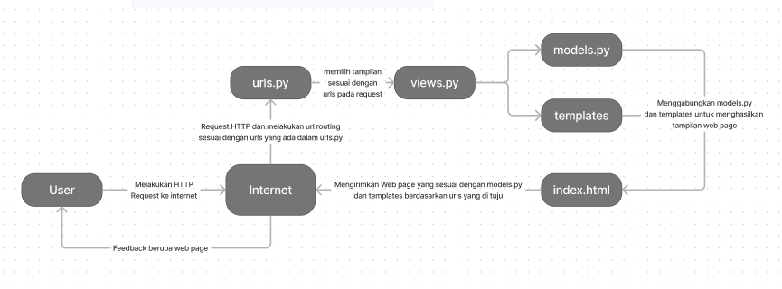

Nama: Taniella \n
NPM: 2206082316

# **TUGAS 3**
1. 

---
# **TUGAS 2**
>Link Adaptable: https://florist.adaptable.app/main

## 1. Jelaskan bagaimana cara kamu mengimplementasikan checklist di atas secara step-by-step (bukan hanya sekadar mengikuti tutorial).
    - Pertama-tama membuat repository baru dan membuat path local dan menyambungkannya pada repository yang sudah dibuat. 
    - Membuat virtual environment sebelum membuat project, menginstall semua requirements yang dibutuhkan lalu membuat Django project bernama florist [dengan command: django-admin startproject florist .]
    - Lalu membuat app main dalam project dengan command: [python manage.py startapp main] yang akan membuat path main dalam path florist. Jangan lupa memasukan 'main' ke dalam INSTALLED_APPS pada settings.py
    - Setelah itu melakukan routing dengan memasukan path main pada url patterns di urls.py pada path florist.
    - Lalu mulai mengisi models dan views juga membuat template htmlnya untuk menampilkan datanya.
    - Melakukan deployment ke Adaptable.

## 2. Buatlah bagan yang berisi request client ke web aplikasi berbasis Django beserta responnya dan jelaskan pada bagan tersebut kaitan antara urls.py, views.py, models.py, dan berkas html.
    
    - urls.py menentukan views.py dan models.py yang akan di akses untuk tampilan dari berkas html yang dijadikan response ke user.

## 3. Jelaskan mengapa kita menggunakan virtual environment? Apakah kita tetap dapat membuat aplikasi web berbasis Django tanpa menggunakan virtual environment?
    - Dalam penggunaan Virtual Environment, kita akan lebih mudah dalam mengerjakan dengan mengisolasi proyek sehingga tidak tercampur dengan proyek-proyek lainnya. Hal ini memastikan versi yang digunakan dari tiap pustaka merupakan versi yang konsisten dan tidak berubah-ubah walau proyek dikerjakan di device yang berbeda dalam tahapan pengembangan.

    - Secara teori tentunya kita bisa membuat aplikasi web berbasis Django tanpa menggunakan virtual env namun hal itu akan memiliki resiko konflik dependensi dan mempersulit kolaborasi antar tim yang tidak dapat memastikan versi yang digunakan untuk tetap konstan.

## 4. Jelaskan apakah itu MVC, MVT, MVVM dan perbedaan dari ketiganya.
    - MVC atau Model-View-Controller adalah pola desain yang memisahkan aplikasi menjadi 3 bagian, Model untuk data dan logika, View untuk presentasi, dan Controller untuk pengendalian logika.

    - MVT atau Model-View-Template adalah pola desain seperti MVC yang dikemas dalam kerangka web Django, perbedaannya hanya dalam Controller yang diganti menjadi Template dan digunakan untuk pengaturan tampilan web

    - MVVM atau Model-View-ViewModel merupakan basis yang digunakan untuk pengembangan aplikasi yang lebih kompleks seperti aplikasi mobile dan desktop modern, perbedaannya berada pada ViewModel yang merupakan konsep unik untuk MVVM yang merupakan perantara antara Model dan View yang mengkonversi data dari Model untuk menjadi format yang dapat ditampilkan oleh view. 